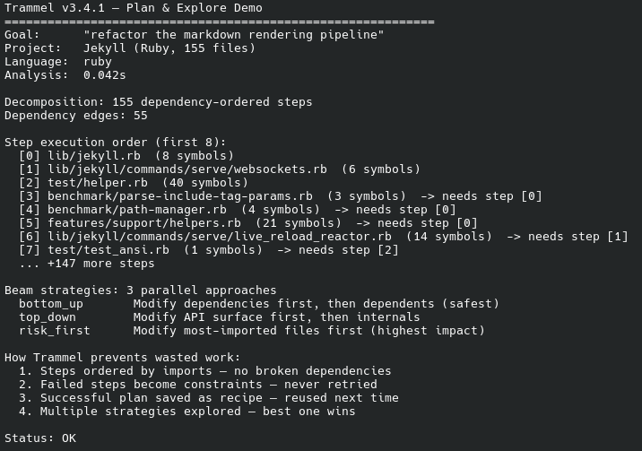

# Trammel — AI Task Planner for Coding Assistants

[](LICENSE)
[](https://www.python.org/downloads/)
[](https://pypi.org/project/trammel/)

**Trammel helps AI coding assistants plan, verify, and remember multi-step tasks.**

Instead of letting your AI assistant wing it on complex changes, Trammel breaks goals into ordered steps, verifies each one works, learns from failures, and saves successful strategies for reuse. It works with **Claude Code**, **Cursor**, and any MCP-compatible editor — or standalone via Python and CLI.

> Trammel is a tool **for** LLMs, not a tool that calls LLMs. It provides the planning discipline that coding assistants need to tackle multi-step tasks reliably.



## What It Does

- **Breaks down goals into steps** — Analyzes your project's code structure, figures out what depends on what, and creates an ordered plan
- **Tries multiple approaches** — Explores different strategies in parallel (bottom-up, top-down, risk-first, and more) to find what works best
- **Verifies as it goes** — Runs your tests after each step in an isolated copy, so bad changes don't pile up
- **Learns from mistakes** — Records what failed and why, then blocks the same mistake from happening again
- **Remembers what worked** — Saves successful strategies as reusable recipes, so similar tasks get solved faster next time
- **Coordinates multiple agents** — Provides step claiming, dependency tracking, and DAG metrics for multi-agent workflows

**15 languages supported:** Python, TypeScript, JavaScript, Go, Rust, C/C++, Java/Kotlin, C#, Ruby, PHP, Swift, Dart, Zig

## Installation

```bash
pip install trammel            # core library (no dependencies beyond Python stdlib)
pip install trammel[mcp]       # with MCP server for Claude Code / Cursor
```

Or from source:

```bash
git clone https://github.com/IronAdamant/Trammel.git
cd Trammel && pip install -e '.[mcp]'
```

## Quick Start

### With Claude Code or Cursor (MCP)

Add to your `.claude/.mcp.json` (Claude Code) or equivalent MCP config:

```json
{
  "mcpServers": {
    "trammel": {
      "command": "trammel-mcp",
      "args": []
    }
  }
}
```

Your AI assistant now has access to 30+ planning tools — decompose goals, create plans, claim steps, verify work, and save recipes. See `SYSTEM_PROMPT.md` for the full orchestration guide.

### From the Command Line

```bash
python -m trammel "refactor auth module" --root /path/to/project --beams 3
python -m trammel "fix tests" --test-cmd "pytest -x -q"
python -m trammel "explore auth" --dry-run          # explore strategies without verification
python -m trammel "fix auth" --root /monorepo --scope services/auth
```

### From Python

```python
from trammel import plan_and_execute, explore, synthesize

# Full pipeline: decompose → plan → explore → verify → store recipe
result = plan_and_execute("your goal", "/path/to/project", num_beams=3)

# Explore only (no verification)
strategy = explore("refactor auth", "/path/to/project")

# Save a verified strategy as a reusable recipe
synthesize("refactor auth", verified_strategy)
```

## How It Works

Trammel treats planning as a structured search problem:

1. **Decompose** — Analyzes imports and builds a dependency graph, then generates ordered steps with rationale. Supports scaffold definitions for new files that don't exist yet.
2. **Explore** — Creates multiple strategy variants (bottom-up, top-down, risk-first, critical-path, cohesion, minimal-change, and more) and runs them in parallel.
3. **Verify** — Applies edits in isolated temp copies and runs tests per-step. Extracts structured failure analysis when something breaks.
4. **Constrain** — Records failure reasons as persistent constraints that prevent the same mistake across sessions.
5. **Remember** — Stores successful strategies as recipes, retrieved later by text similarity + file overlap + success ratio.

All state lives in a local SQLite database (`trammel.db`) — plans, steps, constraints, recipes, and telemetry.

## Integration Options

Trammel doesn't require MCP. The same capabilities are available through multiple surfaces:

| Surface | Best for |
|---------|----------|
| **MCP server** (`trammel-mcp`) | Claude Code, Cursor, and other MCP-aware editors |
| **Python API** (`plan_and_execute`, `explore`, etc.) | Scripts, CI pipelines, custom orchestrators |
| **CLI** (`python -m trammel`) | Shell automation, quick one-off plans |
| **SQLite** (`trammel.db`) | Direct queries, external dashboards, cross-process coordination |

## Multi-Agent Support

When decomposing with a scaffold, Trammel returns DAG metrics for dispatching work across multiple agents:

| Metric | What it tells you |
|--------|-------------------|
| `max_parallelism` | Peak number of agents you can run at once |
| `layer_widths` | How many files can be worked on per round (e.g. `[7, 12, 6, 10, 3, 2]`) |
| `critical_path_length` | The longest chain — your minimum number of rounds |

Agents coordinate via `claim_step` / `release_step` / `available_steps`. Claims auto-expire after 10 minutes for stale agent recovery.

## Works With Stele and Chisel

Trammel works standalone. When co-installed with [Stele](https://github.com/IronAdamant/stele-context) (context retrieval) and [Chisel](https://github.com/IronAdamant/Chisel) (code analysis), all three cooperate through the MCP tool layer — no cross-dependencies between packages.

| Tool | Role |
|------|------|
| **Stele** | Persistent context retrieval and semantic indexing |
| **Chisel** | Code analysis, churn, coupling, risk mapping |
| **Trammel** | Planning, verification, failure learning, recipe memory |

## Plan Fidelity and Configuration

Trammel has controls to keep plans accurate and sub-agents aligned:

- **`strict_greenfield`** — Fails decomposition if a new-work goal has no scaffold, preventing vague improvised plans
- **`relevant_only`** — Filters steps to only what matters for the goal
- **Relevance tiers** — Each step gets `high` / `medium` / `low` relevance so prioritization is transparent

Optional project config via `pyproject.toml` (`[tool.trammel]` section) or `.trammel.json`:

```toml
[tool.trammel]
default_scope = "src/"
focus_keywords = ["auth", "login"]
max_files = 50
```

## Project Layout

```
trammel/              Importable package
  __init__.py         Public API: plan_and_execute, explore, synthesize
  core.py             Planner: decomposition, constraints, step generation
  store.py            RecipeStore: SQLite persistence (8 tables), telemetry
  store_recipes.py    Recipe methods: save, retrieve, list, prune
  strategies.py       9 built-in beam strategies
  harness.py          Execution harness: temp copies, test runner
  analyzers.py        Python + TypeScript analyzers, language detection
  analyzers_ext.py    Go, Rust, C/C++, Java/Kotlin analyzers
  analyzers_ext2.py   C#, Ruby, PHP, Swift, Dart, Zig analyzers
  project_config.py   Config merging (pyproject.toml + .trammel.json)
  utils.py            Trigrams, cosine, failure extraction, shared helpers
  cli.py              CLI entry point
  mcp_server.py       MCP tool schemas and dispatch
  mcp_stdio.py        MCP stdio server entry point
tests/                328 tests across 6 modules (stdlib unittest)
SYSTEM_PROMPT.md      Reference orchestration guide for LLM clients
```

## SQLite Schema (`trammel.db`)

| Table | Purpose |
|-------|---------|
| `recipes` | Successful strategies with pattern, constraints, success/failure counts |
| `recipe_trigrams` | Inverted trigram index for fast recipe retrieval |
| `recipe_files` | File paths for structural matching (Jaccard overlap) |
| `plans` | Goals + strategy snapshots + scaffold with step progress |
| `steps` | Work units with dependencies, rationale, verification results |
| `constraints` | Failure records that prevent known-bad repetition |
| `trajectories` | Run logs per beam: outcome, steps completed, failure reason |
| `failure_patterns` | Historical failure signatures with resolution history |
| `usage_events` | Telemetry: tool calls, recipe hit rates, strategy win rates |

## Contributing

Contributions welcome. Please open an issue first to discuss changes.

1. Fork the repository
2. Create a feature branch (`git checkout -b feature/your-feature`)
3. Make your changes (core must remain stdlib-only; tests use `unittest` only)
4. Run tests: `python -m unittest discover -q -s tests -p 'test_*.py'`
5. Open a pull request

## Publishing (Maintainers)

Releases use **Trusted Publishing** (GitHub OIDC → PyPI). No API tokens needed.

1. Bump `version` in `pyproject.toml`
2. Run tests, commit, push to `main`
3. Tag: `git tag -a vX.Y.Z -m "Release X.Y.Z" && git push origin vX.Y.Z`
4. Create GitHub Release (triggers PyPI publish automatically)

---

<details>
<summary><strong>Full Changelog</strong></summary>

### v3.10.3 — Documentation: scaffold DAG metrics for multi-agent dispatch

- **README:** New "Scaffold DAG Metrics for Multi-Agent Dispatch" section documenting `max_parallelism`, `layer_widths`, `critical_path_length`, and `max_dependency_depth` with usage guidance for parallel agent workflows.
- **Spec:** Added scaffold DAG metrics documentation to §5 Planner.
- **RecipeLab Review Ten closure:** Zero bugs found. Validated 40-step / 59-edge scaffold decomposition with correct topological ordering across 6 feature trees. Largest scaffold and most complex DAG ever tested — flawless.
- **No API changes** — documentation update only.

### v3.10.1 — Fix critical create_plan scaffold migration bug

- **Bug fix**: `create_plan` failed with `"table plans has no column named scaffold"` on existing databases. The schema migration was targeting the wrong table (`steps` instead of `plans`). Fixed in `store.py`.
- **Impact**: Unblocks full plan execution workflow (`create_plan` → `claim_step` → `record_steps` → `complete_plan`).

### v3.9.4 — RecipeLab findings: scaffold metrics, skip-UX, refactor hints, CI checklist

- **Planner / MCP:** `suppress_creation_hints`, `scaffold_dag_metrics`, `skipped_existing_scaffold`; refactor-verb guard for creation inference; `summary_only` surfaces DAG + skip blocks.
- **Tests:** `tests/test_findings_checklist.py` encodes validation matrix A–C (305 tests). **Core remains stdlib-only** (zero third-party runtime deps).

### v3.9.1 — Documentation: MCP-optional integration, releasing guide

- **README:** Integration surfaces (API / CLI / SQLite vs MCP), roadmap notes, release checklist for Trusted Publishing.
- **Wiki / spec:** §1.1–1.2 alignment; `SYSTEM_PROMPT.md` tracked in repo (sub-agents without MCP).
- **No API changes** — doc and packaging metadata refresh for PyPI long description.

### v3.7.9 — Comprehensive cleanup: dead code, bug fixes, modernization, robustness
- **Bug fixes**: CLI goal validation (`str(None)` bug), missing `created` column in step queries, mixin stubs now raise `NotImplementedError`, `_sql_in` empty-input guard.
- **Dead code**: Removed unused `_is_ignored_dir` import from `analyzers_ext2.py`.
- **Hardening**: Replaced all positional `sqlite3.Row` unpacking with named column access (8 sites). Pre-compiled Rust/Cargo/Maven regex patterns at module level.
- **Simplification**: Beam-count capping, step description helper, list_strategies comprehension, `_validate_registries()` wrapper.
- **Modernization**: Walrus operator in `_extract_step_files`, `TYPE_CHECKING` imports, private `_cosine` naming, KeyboardInterrupt handling in MCP stdio.
- **248 tests** (all passing).

### v3.7.8 — Code quality: DRY step dicts, simplified helpers, consistent isinstance
- **DRY step dicts**: Extracted `_STEP_COLUMNS` + `_step_to_dict()` in store.py — eliminates duplicated step-dict construction in `get_plan()` and `get_step()`.
- **Simplified helpers**: `word_jaccard`, `cosine`, `_strip_php_comments` in utils.py condensed (reduced total LOC).
- **Consistent isinstance**: Fixed `type()` vs `isinstance()` inconsistency in `PythonAnalyzer.collect_typed_symbols`.
- **248 tests** (all passing).

### v3.7.4 — Code quality: dead code removal, simplification & modernization
- **Bug hardening**: Fixed potential `ZeroDivisionError` in `explore_trajectories`, `ValueError` with 0 beams, replaced fragile `assert` with `RuntimeError` in MCP server.
- **Dead code removal**: Removed unused `_default_beam_count`, dead `TYPE_CHECKING: pass` block.
- **Simplification**: Consolidated 4 SQL COUNT queries into 1, extracted `_sql_in()` helper (deduplicates 8 sites), eliminated redundant dict copies, simplified confusing list-unpacking comprehension.
- **Modernization**: `asyncio.to_thread` replaces `run_in_executor`, logger configured at module level for early error capture, lazy `_get_analyzer_registry()` replaces late inline imports.
- **248 tests** (all passing).

### v3.7.3 — Code quality: deduplication, modernization & hardening
- **Deduplication**: Extracted shared trigram/file helpers in `store_recipes.py`, deduplicated Swift SPM scanning.
- **Modernization**: `_count_importers` uses `Counter`, set-based symbol deduplication, f-string continuation.
- **Hardening**: Narrowed telemetry exception to `sqlite3.Error`, fixed type annotation, named constants for magic numbers.
- **Cleanup**: Marked unused MCP handler params, fixed Dart import mutual exclusivity.
- **248 tests** (all passing).

### v3.7.2 — Codebase audit & cleanup
- **Bug fixes**: Fixed `_inject_orderings` None-key dict comprehension, recipe mutation in `decompose()`, hardcoded DB path in `synthesize()`, missing `claimed_by`/`claimed_at` in `get_step()`.
- **Cross-platform**: Normalized Swift analyzer path separator handling.
- **248 tests** (all passing).

### v3.7.1 — Mixin type safety, robustness & performance
- **Type safety**: Added typed attribute stubs to `RecipeStoreMixin` and `AgentStoreMixin` for type-checker compatibility.
- **Robustness**: `claim_step` rejects non-pending steps; parallel beam fallback narrowed to `OSError` only with debug logging.
- **Performance**: `run_incremental` optimized from O(K^2) to O(K) via persistent base copy.
- **Test coverage**: 9 new `collect_typed_symbols` tests (Rust, C++, Java, C#, Ruby, PHP, Swift, Dart, Zig).
- **248 tests** (all passing).

### v3.7.0 — Comprehensive audit, bug fixes & modernization
- **8 bug fixes**: Critical-path cycle leak, `log_event` bare commit, schema migration over-broad catch, inconsistent win-rate formulas, `trigram_signature` fingerprint type bug, Rust cargo relpath bug, Java import comment stripping, PHP grouped-use alias stripping.
- **Dead code**: Removed `ExecutionHarness.run()` alias.
- **Simplification**: N+1 query fix in recipe retrieval, SQL-side recipe pruning, `_walk_project_sources` shared generator, `DEFAULT_DB_PATH` constant consolidation.
- **Modernization**: `_SUPPORTED_LANGUAGES` derived from registry, language/analyzer sync assertion, mid-file imports moved to top, premature Python 3.14 classifier removed.
- **239 tests** (all passing).

### v3.6.0 — Codebase audit, bug fixes & modernization
- **Bug fixes**: Fixed TOCTOU race in `record_failure_pattern` and `resolve_failure_pattern` (wrapped in transactions). Fixed `JavaAnalyzer.pick_test_cmd` fallback to use system `gradle` instead of nonexistent `./gradlew`.
- **Duplication elimination**: Extracted `_count_importers()`, `_is_claimed_by_other()`, `_try_resolve()` helpers. `run()` now delegates to `verify_step()`. Removed redundant `_collect_files` wrappers. Merged two transactions in `validate_recipes`.
- **Dead code removal**: Always-true guard, unnecessary `or ""`, redundant assignment, ineffective deferred import.
- **Modernization**: `collections.abc.Callable`/`Generator` imports, PEP 561 `py.typed` marker, `get_analyzer` added to `__all__`, `.mypy_cache`/`.ruff_cache` in `.gitignore`.
- **Simplifications**: Single-pass `_split_active_skipped`, defensive `.get()` for constraint descriptions, simplified test assertions.
- **239 tests** (all passing).

### v3.5.2 — Codebase cleanup & modernization
- **Consolidated comment strippers**: removed duplicate `_strip_js_comments` and `_strip_cpp_comments`, all analyzers now use the shared `_strip_c_comments` from utils
- **Consistent import analysis**: all regex-based analyzers now strip comments before extracting imports (fixes false positives from commented-out imports in Ruby, Dart, Zig, C#, PHP)
- **Fixed PHP method pattern overlap**: method pattern now requires at least one access modifier (changed `*` to `+`), preventing duplicate symbol entries with the function pattern
- **Fixed Dart function false positives**: added negative lookahead to exclude control flow keywords (`if`, `for`, `while`, etc.)
- **Improved `max()` type safety**: `detect_language` extension counting now uses `lambda k: counts[k]` instead of `counts.get`
- **Modernized `str.endswith`**: uses native tuple form throughout `_collect_*` helpers
- **Removed redundant `store` parameter** from `Planner.explore_trajectories` (uses `self.store`)
- **MCP status handler refactored**: now delegates to `RecipeStore.get_status_summary()` instead of raw SQL
- **Schema/dispatch sync assertion**: module-load assertion ensures `_TOOL_SCHEMAS` and `_DISPATCH` keys stay in sync
- **Store improvements**: removed unreliable `__del__`, narrowed schema migration exception to `sqlite3.OperationalError`, fixed `list_plans` status filter, fixed `get_strategy_stats` return type, batch-fetched recipe files in `list_recipes` (N+1 fix)
- **Fixed float equality**: recipe text similarity early-exit now uses `>= 0.9999` instead of `== 1.0`
- **Logging setup fix**: `mcp_stdio.py` now calls `logging.basicConfig` before server construction
- **CLI hardening**: added JSON parse error handling for stdin input
- **Language-agnostic messages**: "No Python symbols" fallback message now says "No symbols found"
- **`__main__.py` guard**: added `if __name__ == "__main__"` protection

### 3.5.1

- **Multi-agent step coordination**: New `claim_step`, `release_step`, and `available_steps` MCP tools (27 tools total). Agents claim steps before working on them — other agents see claimed steps and skip them. Claims auto-expire after 10 minutes (stale agent recovery). `available_steps` returns only steps whose dependencies are satisfied AND aren't claimed by another agent.
- **New `store_agents.py` mixin**: `AgentStoreMixin` with `claim_step()`, `release_step()`, `get_available_steps()`. `RecipeStore` inherits from both `RecipeStoreMixin` and `AgentStoreMixin`.
- **Schema migration**: Steps table gains `claimed_by` and `claimed_at` columns (safe migration for existing databases).
- **242 tests** (all passing).

### 3.5.0

- **Failure pattern learning**: New `failure_patterns` SQLite table (9 tables total) accumulates structured failure signatures across sessions. When a step fails with verification data, the file + error type + message are auto-recorded. Patterns track occurrence count, first/last seen timestamps, and resolution history.
- **`failure_history` MCP tool**: Query historical failure patterns by file or project-wide. Shows which files fail frequently, what error types occur, and what resolutions worked. Use before modifying a file to avoid known pitfalls.
- **`resolve_failure` MCP tool**: Record what fixed a known failure pattern. Builds institutional memory of what works for specific error types on specific files. 24 MCP tools total.
- **Auto-recording**: `update_step` with `status="failed"` automatically extracts failure analysis and records the pattern — no manual instrumentation needed.
- **242 tests** (all passing).

### 3.4.1

- **C++ nested template parsing**: Template patterns now handle 2 levels of nesting (`template<typename T, std::vector<int>>`) instead of breaking at the first `>`. Also fixed in Rust `impl<>` and Java/Kotlin generic `fun<>` patterns.
- **Rust workspace + relative imports**: `analyze_imports` now resolves `use super::`, `use self::`, and workspace crate imports (reads `Cargo.toml` `[workspace] members` and member crate names). Previously only `use crate::` was handled.
- **PHP grouped use statements**: `use Foo\{Bar, Baz, Qux};` (PHP 7.0+) now correctly expanded and resolved. Previously only simple `use Foo\Bar;` was parsed.
- **Swift SPM-aware module mapping**: Detects `Sources/<Module>/` and `Tests/<Module>/` directory structure for Swift Package Manager projects. Falls back to parent-directory mapping for non-SPM projects.
- **TypeScript monorepo workspace support**: Reads `package.json` `workspaces` field (npm, yarn, pnpm patterns), discovers workspace packages, resolves bare imports (`import { x } from '@scope/pkg'`) to workspace package entry points.
- **242 tests** (all passing).

### 3.4.0

- **Usage telemetry**: New `usage_events` SQLite table (8 tables total) with `log_event()` and `get_usage_stats()` methods on `RecipeStore`. Tool calls, recipe hit/miss rates, and strategy win rates tracked automatically. New `usage_stats` MCP tool (22 tools total) returns aggregated telemetry over a configurable time window.
- **Dispatch refactor**: Replaced 153-line `match/case` in `mcp_server.py` with dispatch-dict pattern. Each tool has a dedicated handler function, looked up via `_DISPATCH` dict. Adding new tools now requires only: handler function + schema + dict entry.
- **Analyzer improvements**: PHP class methods now detected (was major gap). Java 16+ `record` keyword supported. Dart factory/named constructors detected.
- **Comment stripping for 7 languages**: Added `_strip_c_comments` (shared by Go, Rust, Java, C#, Swift, Dart, Zig), `_strip_hash_comments` (Ruby), and `_strip_php_comments` (PHP). Previously only Python (AST), TypeScript, and C/C++ stripped comments before symbol detection.
- **5 new sample repos**: Jekyll (Ruby), Flame (Dart), ZLS (Zig), Laravel (PHP), Ktor (Kotlin) cloned to `sample_file_test/` for analyzer validation across all 15 supported languages.
- **242 tests** (all passing).

### 3.3.1

- **Strategy module extraction**: Beam strategy registry and 9 built-in orderings extracted from `core.py` into new `strategies.py` (~280 LOC). `core.py` reduced from 595 to 324 LOC, well under the 500 LOC limit.
- **Eliminated circular dependency workarounds**: Moved shared `_collect_symbols_regex` and `_collect_typed_symbols_regex` helpers from `analyzers.py` to `utils.py`. Removed `functools.cache` lazy-import wrappers from `analyzers_ext.py` and `analyzers_ext2.py` (12 lines each), replaced with direct imports.
- **DRY regex patterns**: Derived `_*_SYMBOL_PATTERNS` from `_*_TYPED_PATTERNS` via `[p for p, _ in _*_TYPED_PATTERNS]` for TypeScript, Rust, Java, C#, Ruby, PHP, Swift, and Dart (8 languages). Eliminates ~70 lines of duplicated regex definitions.
- **DRY Python AST walking**: Extracted `PythonAnalyzer._iter_ast()` generator, shared by both `collect_symbols` and `collect_typed_symbols`, eliminating duplicated file-walking and AST-parsing code.
- **Import ordering fix**: Fixed stdlib import ordering in `store_recipes.py` (`import os` moved before local imports).
- **All files under 500 LOC**: `analyzers.py` reduced from 559 to 463 LOC. Total source: 3,876 to 3,771 LOC (105 lines net reduction through deduplication).
- **242 tests** (unchanged, all passing).

### 3.3.0

- **Typed symbol analysis**: New `collect_typed_symbols()` method on all 15 analyzers returns symbols with type classification (function, class, interface, enum, struct, trait, etc.).
- **3 new beam strategies** (9 total): `leaf_first` (zero-importer files first), `hub_first` (network hub files by in*out degree), `test_adjacent` (files with matching test files first).
- **Analyzer fixes**: Ruby basename overwriting, Swift overly broad directory mapping, Java packageless file gap.
- **Store refactor**: `_init_schema()` decomposed into class-level SQL constants.
- **242 tests** (12 new).

### 3.2.1

- **Bug fix**: `retrieve_best_recipe` scoring bug where `best_score` was updated before JSON validation — corrupted entries could shadow valid recipes.
- **Dead code removed**: unused `total_files` variable in `estimate` tool, redundant `get_analyzer` re-import.
- **Code simplification**: `detect_language` replaced 8 extension alias constants and 12-branch if/elif with data-driven loop. Lambda replaced with `def` in `_detect_from_config`. Redundant `DartAnalyzer.pick_test_cmd` branch removed.
- **Performance**: eliminated double file reads in C#/PHP analyzers; Go analyzer reduced from two walks to one; PHP namespace lookup optimized from O(n) to O(1).
- **Modernization**: added return type annotations to `_get_collect_symbols_regex`. Moved `_SUPPORTED` to module-level `_SUPPORTED_LANGUAGES` frozenset. Simplified `__main__.py`.
- **230 tests** (unchanged).

### 3.2.0

- **Six new language analyzers**: `CSharpAnalyzer` (.cs), `RubyAnalyzer` (.rb), `PhpAnalyzer` (.php), `SwiftAnalyzer` (.swift), `DartAnalyzer` (.dart), `ZigAnalyzer` (.zig) in new `analyzers_ext2.py` (~480 LOC). Total: 15 supported languages (Python, TypeScript, JavaScript, Go, Rust, C/C++, Java/Kotlin, C#, Ruby, PHP, Swift, Dart, Zig).
- **Config-file detection expanded**: Package.swift (swift), build.zig (zig), pubspec.yaml (dart), .csproj/.sln (csharp), Gemfile (ruby), composer.json (php).
- **Extension counting expanded**: `.cs`, `.rb`, `.php`, `.swift`, `.dart`, `.zig` all counted in `detect_language` fallback.
- **Registry expanded**: 15 languages in `_ANALYZER_REGISTRY`. MCP `_LANGUAGES` list updated to match.
- **Exports expanded**: `CSharpAnalyzer`, `DartAnalyzer`, `PhpAnalyzer`, `RubyAnalyzer`, `SwiftAnalyzer`, `ZigAnalyzer` exported from `__init__.py`.
- **All 21 sample repos re-tested**: zero errors across all languages and scopes.
- **230 tests** (15 new: symbols/imports for C#, Ruby, PHP, Swift, Dart, Zig + 6 config detection).

### 3.1.0

- **Abbreviation handling in recipe matching**: New `_ABBREVIATIONS` dict in `utils.py` with ~40 common coding abbreviations (gc, db, auth, api, etc.). `normalize_goal` expands abbreviations before applying verb synonyms. Recipe matching that previously failed (e.g., "optimize GC" vs "optimize garbage collector") now works with 0.86+ similarity.
- **Analysis timing metadata**: `decompose` now returns `analysis_meta` in the response with `language`, `scope`, `files_analyzed`, `dep_files`, `dep_edges`, `timing_s` (symbols, imports, total), and optional `warning` for unsupported language fallbacks.
- **`estimate` MCP tool**: Quick file count for a project or scope without running full analysis. Returns `language`, `matching_files`, `recommendation` ("use scope" if >5000 files, "full analysis OK" otherwise). Helps LLMs decide whether to scope before analyzing large repos. 21 MCP tools total.
- **Iterative critical_path strategy**: Converted recursive `_longest` depth computation to iterative stack-based DFS with cycle detection via `in_stack` set. Fixes stack overflow on deep dependency graphs (Guava's 1.66M-edge Java import graph was crashing).
- **215 tests** (5 new: 3 abbreviation, 1 analysis meta, 1 estimate tool).

### 3.0.0

- **Monorepo scope support**: New `scope` parameter on `decompose`, `explore`, `plan_and_execute`, CLI (`--scope`), and MCP tools. Limits analysis to a subdirectory while keeping the full project available for test execution. Example: `--scope services/auth` analyzes only `services/auth/`.
- **Concurrent write safety**: Validated with threading tests (4 threads x 5 operations). Plans, recipes, and constraints all survive concurrent access without errors.
- **206 tests** (6 new: 3 concurrent, 3 scope).

### 2.9.0

- **Plan resumption**: New `get_plan_progress(plan_id)` returns accumulated `prior_edits` from passed steps and `remaining_steps` for continuing failed plans. New `resume` MCP tool.
- **Recipe validation**: New `validate_recipes(project_root)` checks recipe file entries against current project, removes stale entries, prunes fully-stale recipes. New `validate_recipes` MCP tool.
- **Config-file language detection**: `detect_language()` now checks config files first (Cargo.toml, go.mod, tsconfig.json, package.json, build.gradle, CMakeLists.txt, pyproject.toml) before falling back to extension counting. Config detection takes priority.
- **Shared file-collection helper**: New `_collect_project_files(root, extensions)` in `utils.py` replaces duplicated `os.walk` patterns in TypeScriptAnalyzer, CppAnalyzer, RustAnalyzer.
- **`verify_step` language support**: MCP tool gains `language` parameter for auto-detecting test command and error patterns.
- **`explore_trajectories`** now uses existing `_split_active_skipped` helper instead of reimplementing inline.
- **Full MCP dispatch test coverage**: All 20 tools now have explicit dispatch tests.
- **200 tests** (25 new).

### 2.8.0

- **Codebase cleanup**: Removed unused imports (`Any` from `analyzers.py`, `json` from `analyzers_ext.py`, `ExecutionHarness`/`dumps_json` from `test_strategies.py`). Replaced fragile lazy-import global in `analyzers_ext.py` with `functools.cache` (thread-safe, simpler). Fixed overly broad `BaseException` → `Exception` in transaction rollback (`utils.py`). Modernized `conn.commit()`/`conn.rollback()`. Optimized `_order_cohesion` set creation. Updated `SYSTEM_PROMPT.md` (tool count 17→18, added C/C++/Java/Kotlin to multi-language section).
- **175 tests** (unchanged).

### 2.7.0

- **Store module split**: Extracted recipe methods (`save_recipe`, `retrieve_best_recipe`, `list_recipes`, `prune_recipes`, `_rebuild_trigram_index`, `_backfill_files`) into `store_recipes.py` as `RecipeStoreMixin` (~210 LOC). `RecipeStore` in `store.py` now inherits from it (~342 LOC, down from 540).
- **Expanded C++ symbol detection**: Replaced single function pattern in `CppAnalyzer` with 5 targeted patterns: template functions, qualified functions (static/inline/constexpr), operator overloading, constructor/destructor detection, macro-prefixed functions (EXPORT_API etc).
- **Java/Kotlin source root detection**: New `JavaAnalyzer._detect_source_roots(project_root)` reads `build.gradle`/`build.gradle.kts` and `pom.xml` to find standard source directories (`src/main/java`, `src/main/kotlin`, etc). Falls back to project root. `analyze_imports` now walks detected source roots instead of project root.
- **MCP tool `prune_recipes`**: Exposed recipe pruning as MCP tool with `max_age_days` and `min_success_ratio` parameters. 18 MCP tools total.
- **175 tests** (9 new: 5 C++ expansion, 3 Java source roots, 2 MCP prune, minus 1 renamed).

### 2.6.0

- **Parallel beam execution**: `plan_and_execute` runs beams concurrently via `concurrent.futures.ProcessPoolExecutor` (stdlib). Falls back to sequential on systems where process spawning fails.
- **C/C++ and Java/Kotlin analyzers**: New `CppAnalyzer` (`.c/.cpp/.cc/.cxx/.h/.hpp/.hxx`, class/struct/namespace/enum/typedef/function symbols, `#include "..."` resolution) and `JavaAnalyzer` (`.java/.kt/.kts`, class/interface/enum/fun/object/@interface symbols, package-based import resolution) in `analyzers_ext.py`. MCP language enum expanded to 9 entries.
- **Analyzer module split**: `analyzers.py` split into `analyzers.py` (~370 LOC) + `analyzers_ext.py` (~400 LOC) to stay under 500 LOC per file. All existing imports preserved via re-export.
- **Recipe pruning**: New `RecipeStore.prune_recipes(max_age_days=90, min_success_ratio=0.1)` removes stale, low-quality recipes with cascade deletes to `recipe_trigrams` and `recipe_files`.
- **Harness base-copy caching**: New `prepare_base(project_root)` and `run_from_base(edits, base_dir)` create one filtered base copy; beams copy from it instead of re-filtering per beam.
- **`--dry-run` and `--language` CLI flags**: `--dry-run` runs `explore()` instead of `plan_and_execute()`.
- **Decomposed `_apply_constraints`**: 85-line function in `core.py` split into `_parse_constraints`, `_mark_avoided`, `_inject_orderings`, `_mark_incompatible`, `_add_prerequisites`.
- **166 tests** (20 new).

### 2.5.0

- **Code cleanup**: Removed unused `import sys` from `harness.py`. Eliminated duplicate `set(symbols) | set(dep_graph)` computation in `Planner.decompose` (`core.py`). Added defensive `json.loads` error handling in `retrieve_best_recipe` (`store.py`). Made failure default explicit in `get_strategy_stats` (`store.py`). Fixed `register_strategy` parameter order in `spec-project.md` documentation.
- **146 tests** (unchanged).

### 2.4.0

- **Go and Rust support**: New `GoAnalyzer` (regex-based, reads `go.mod` for module path, resolves internal imports) and `RustAnalyzer` (regex-based, resolves `use crate::` and `mod` declarations). Shared `_collect_symbols_regex` helper for regex-based analyzers. `detect_language` expanded to count `.go`/`.rs` files. Registry now supports 5 languages.
- **TypeScript enhancements**: `_strip_c_comments` for comment stripping before symbol/import detection. Namespace pattern added to `_TS_SYMBOL_PATTERNS`.
- **Improved beam strategies**: `_order_bottom_up` stable-sorts by ascending dependency count (files with fewer deps first). `_order_top_down` stable-sorts by descending dependency count (most consumer-facing files first). Both now genuinely use the `dep_graph` parameter.
- **Better recipe matching**: New `word_substring_score(a, b)` for partial word matching. `goal_similarity` reweighted: 0.3 trigram cosine + 0.4 word Jaccard + 0.3 substring (was 0.4/0.6).
- **Store improvements**: Merged duplicated SQL branches in `save_recipe`, `list_plans`, `get_active_constraints`. Composite scoring gains recency weighting (30-day half-life). New weights: text 0.4, files 0.25, success 0.15, recency 0.2. File trimmed from 534 to 516 lines.
- **MCP server refactor**: `_schema()` and `_prop()` helpers reduce from 507 to 255 lines. Added "go" and "rust" to language enums.
- **146 tests** (17 new: 4 Go, 3 Rust, 2 TS enhancement, 2 detection, 2 strategy, 4 matching).

### 2.3.0

- **Code cleanup**: Extracted `_split_active_skipped` helper in `core.py`, shared by all 6 beam strategy functions (eliminates duplicated active/skipped split pattern). Modernized `_VERB_SYNONYMS` in `utils.py` from imperative loop to dict comprehension (eliminates leaked module-level variables `_canonical`, `_variants`, `_v`).
- **Documentation fixes**: Corrected canonical verb form examples in glossary and spec (was "refactor", now correctly "restructure"). Fixed `register_strategy` parameter order in glossary (`(name, description, fn)` not `(name, fn, description)`).
- **129 tests** (unchanged).

### 2.2.0

- **Improved recipe matching**: New `_VERB_SYNONYMS` (40+ verb variants to 9 canonical forms), `normalize_goal`, `word_jaccard`, and `goal_similarity` (0.4 trigram cosine + 0.6 word Jaccard on normalized text) in `utils.py`. `save_recipe` normalizes before trigram indexing. `retrieve_best_recipe` uses `goal_similarity`. `_backfill_trigrams` renamed to `_rebuild_trigram_index` (rebuilds with normalized text on init).
- **New beam strategies** (6 total, 3 new): `critical_path` (longest dependency chain first — bottleneck feedback), `cohesion` (flood-fill connected components, largest first, toposort within), `minimal_change` (fewest symbols first — quick wins).
- **TypeScript analyzer improvements**: `_TS_SYMBOL_PATTERNS` list replacing single regex (interface, enum, const enum, type alias, abstract class, decorated class, function expression). Expanded import detection (re-exports, barrel exports, type re-exports, dynamic imports). New `_TS_ALIAS_IMPORT_RE`, `_read_ts_path_aliases`, `_resolve_alias`. Added `.mts`/`.mjs` extensions.
- **129 tests** (34 new: 10 recipe matching, 9 strategy, 15 TypeScript).

### 2.1.0

- **Code cleanup**: Removed dead `json` import from `core.py`. Eliminated duplicated error patterns between `utils.py` and `PythonAnalyzer`. Removed duplicated `_pick_test_cmd` from `harness.py` (falls back to `PythonAnalyzer`). Removed `analyze_imports` backward-compat wrapper from `utils.py`.
- **95 tests** (1 obsolete backward-compat test removed).

### 2.0.0

- **Reference LLM integration**: New `SYSTEM_PROMPT.md` providing a reference orchestration guide for LLM clients (plan-verify-store loop).
- **New MCP tools**: `update_plan_status` (exposes existing store method), `deactivate_constraint` (exposes existing store method). `status` tool now includes `tools` count in response. Tool count 16 → 17.
- **96 tests** (4 new).

### 1.9.0

- **Structural recipe matching**: New `recipe_files` table in SQLite schema (7 tables total) with indexes on both columns. `save_recipe` populates `recipe_files` with file paths from strategy steps. `_backfill_files()` auto-migrates existing databases.
- **Composite scoring**: `retrieve_best_recipe` accepts optional `context_files` for composite scoring — text similarity (0.5), file overlap via Jaccard (0.3), success ratio (0.2). Without `context_files`, scoring is backward-compatible (text-only).
- **Planner integration**: `Planner.decompose` passes project file context to recipe retrieval (two-phase: text-only fast path, then structural).
- **New MCP tools**: `list_recipes` (limit=20), `get_recipe` gains `context_files` parameter. Tool count 14 → 16.
- **92 tests** (9 new recipe tests).

### 1.8.0

- **Multi-language support**: New `trammel/analyzers.py` with `LanguageAnalyzer` protocol, `PythonAnalyzer`, `TypeScriptAnalyzer` (regex-based, stdlib-only), `detect_language()`, `get_analyzer()`.
- **Planner integration**: `Planner` accepts optional `analyzer` parameter, auto-detects language. `ExecutionHarness` accepts optional `analyzer` for language-specific test commands and error patterns.
- **Refactored analysis**: `_collect_python_symbols` removed from `core.py` (moved to `PythonAnalyzer`). `analyze_imports` in `utils.py` now a backward-compat wrapper delegating to `PythonAnalyzer`. `ast` import removed from `utils.py`.
- **`analyze_failure`** accepts optional `error_patterns` parameter.
- **`_IGNORED_DIRS` expanded**: `.next`, `.nuxt`, `coverage`, `.turbo`, `.parcel-cache`.
- **`language` parameter** added to `plan_and_execute`, `explore`, and MCP `decompose`/`explore` tools.
- **New exports**: `PythonAnalyzer`, `TypeScriptAnalyzer`, `detect_language` from `trammel.__init__`.
- **83 tests** (13 new in `tests/test_analyzers.py`).

### 1.7.0

- **Pluggable strategy registry**: New `register_strategy()` and `get_strategies()` API in `core.py` with `StrategyFn` and `StrategyEntry` types. Three built-in strategies (`bottom_up`, `top_down`, `risk_first`) auto-registered at module load. Strategy functions use unified signature `(steps, dep_graph) -> steps`.
- **Strategy learning**: `explore_trajectories` accepts optional `store` for learning feedback. When provided, strategies sorted by historical success rate from trajectory data. `plan_and_execute` and `explore` pass store to enable learning.
- **Strategy stats**: `RecipeStore.get_strategy_stats()` aggregates trajectory outcomes by variant (success/failure counts per strategy).
- **New MCP tool**: `list_strategies` returns registered strategy names with success/failure stats. Tool count 13 → 14.
- **New exports**: `register_strategy` and `get_strategies` exported from `trammel.__init__`.
- **Test reorganization**: New `tests/test_strategies.py` with 8 strategy-focused tests. `TestBeamStrategies` moved from `test_trammel_extra.py`. Test count 62 → 70.

### 1.6.0

- **Simplified symbol collection**: `_collect_python_symbols` returns symbol name strings instead of redundant dicts; unused `file`, `type`, `line` fields removed (only `name` was consumed downstream).
- **Removed dead parameter**: `_step_rationale` no longer accepts unused `filepath` argument.
- **Inlined beam descriptions**: Removed `_BEAM_STRATEGIES` module-level constant; descriptions inlined at usage site, eliminating fragile index-based coupling.
- **Documentation fix**: Removed duplicated extension point line in `spec-project.md`.

### 1.5.0

- **Concurrent write protection**: All mutating `RecipeStore` methods wrapped in explicit `BEGIN IMMEDIATE` transactions with exponential backoff retry on `SQLITE_BUSY`. Multi-statement operations like `create_plan` are now atomic. `db_connect` sets `timeout=5.0`.
- **Recipe retrieval at scale**: Inverted trigram index (`recipe_trigrams` table with B-tree index). `retrieve_best_recipe` now queries candidate recipes by shared trigrams before computing exact cosine, avoiding full table scans. Existing databases auto-backfill on schema init.
- **Constraint propagation**: New `_apply_constraints` enforces active constraints during decomposition — `avoid` skips files, `dependency` injects ordering, `incompatible` marks conflict metadata, `requires` adds prerequisite steps. Strategy output now includes `constraints_applied`.
- **Constraint-aware beam strategies**: `_order_bottom_up` and `_order_top_down` place skipped steps at end. `_order_risk_first` isolates incompatible steps and batches by package directory. `explore_trajectories` excludes skipped steps from beam edits.
- **RecipeStore context manager**: Added `close()`, `__enter__`/`__exit__`, and `__del__` safety net. All public API functions and MCP server use `with RecipeStore(...)`.

### 1.4.0

- **Import consistency**: Converted absolute imports in `mcp_stdio.py` to relative imports, matching the rest of the package.
- **Dead exception handling**: Removed unreachable `UnicodeDecodeError` from `_collect_python_symbols` except clause (`core.py`). Files are opened with `errors="replace"`, so the exception can never be raised.
- **Ignored directories**: Added `.chisel` to `_IGNORED_DIRS` in `utils.py` (tool cache directory, same category as `.mypy_cache`, `.ruff_cache`).

### 1.3.0

- **Dead code removal**: Removed unused test imports (`explore`, `synthesize`, `analyze_imports`, `cosine`, `trigram_bag_cosine`, `trigram_signature`). Removed dead `goal_slice` parameter from `_collect_python_symbols` — computed per symbol but never consumed downstream.
- **Simplified topological sort**: Removed redundant `rev.setdefault()` call where keys are guaranteed to exist from pre-initialization.
- **Documentation fix**: `plan_and_execute` API signature in spec now includes `test_cmd` parameter.

### 1.2.0

- **Version from metadata**: `__version__` now derived from `importlib.metadata` at runtime, eliminating version duplication between `pyproject.toml` and source code.
- **Match/case dispatch**: `dispatch_tool` in `mcp_server.py` converted from 13-branch if/elif chain to Python 3.10+ `match/case`.
- **Configurable test command**: `ExecutionHarness` accepts `test_cmd` parameter for custom test runners (e.g. pytest). Propagated through `plan_and_execute`, CLI (`--test-cmd`), and MCP `verify_step` tool.
- **Recipe retrieval optimization**: `retrieve_best_recipe` short-circuits on exact match (similarity 1.0).
- **Tests package**: Added `tests/__init__.py`.

### 1.1.0

- **Dead code removal**: Removed unused `advance_plan_step` method from `RecipeStore`, unused `json`/`os` imports from `mcp_server.py`, unused `json` import from tests.
- **Consolidated ignored-dirs**: Unified hardcoded directory skip list in `harness.py` with `_IGNORED_DIRS` from `utils.py` via new `_is_ignored_dir` helper. Fixed `egg-info` pattern that could never match actual `*.egg-info` directories.
- **Performance**: `topological_sort` uses `collections.deque` instead of `list.pop(0)` for O(1) queue operations.
- **Simplified core**: Replaced verbose loop in `Planner.decompose` with set union for `all_files` construction.

### 1.0.0

- **Dependency-aware planning**: Import analysis via AST, topological sort, steps with ordering rationale and dependencies.
- **Real beam branching**: Three strategies -- `bottom_up`, `top_down`, `risk_first` -- instead of label variations.
- **Incremental verification**: Per-step harness with `verify_step()` and `run_incremental()`.
- **Failure analysis**: Structured error extraction (type, message, file, line, suggestion).
- **Constraint propagation**: Persistent failure constraints that block repetition across sessions.
- **MCP server**: 13 tools exposed via stdio transport, matching Stele/Chisel pattern (expanded to 17 by v2.0.0).
- **Enriched schema**: Recipes store strategies + constraints + failure counts. Plans track step-level status. New `steps` and `constraints` tables.

### 0.3.0

- Recipe retrieval requires minimum similarity threshold (0.3).
- `_collect_python_symbols` collects `async def` and skips ignored directories.
- Deduplicated trigram computation; removed dead code.

### 0.2.0

- Correct trigram similarity for recipe retrieval; tie-break on stored success counts.
- Test subprocess uses `sys.executable`; SQLite `foreign_keys=ON`.
- Beam `edits` include `path`; JSON serialization centralized via `dumps_json`.
- `__version__` and CLI `--version`.

</details>
